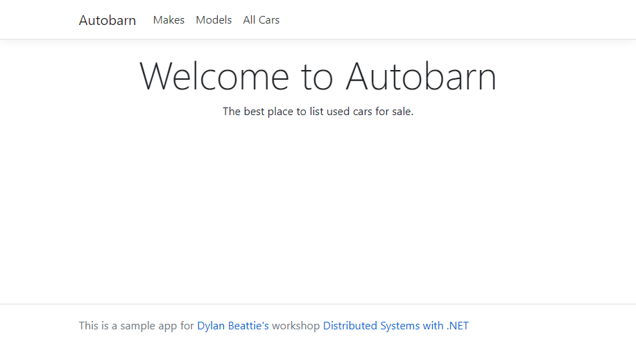

# Autobarn
This is the sample application for Dylan Beattie's workshop on distributed systems with .NET. It's an Asp.NET Core web application based on very simple data model for advertising used cars for sale.

## Getting Started

Autobarn uses a MS SQL Server database that's available as a Docker container image. You'll need Docker installed to run it.

```
docker run -p 1433:1433 -d ursatile/ursatile-workshops:autobarn-mssql2019-latest
```

Run the `Autobarn.Website` project. *(The sample projects are configured for .NET 5.0, but will run on .NET Core 3.1 or Framework 4.6 if you modify the .csproj files to change the project targets - see below)*

```
cd dotnet
cd Autobarn.Website
dotnet run
```

Browse to [http://localhost:5000](http://localhost:5000) and you should see the Autobarn homepage:



Click the "All Cars" link (or go to http://localhost:5000/vehicles) and you should see a long list of car registration numbers.

### Changing the .NET Target Version

You'll need to edit `Autobarn.Website\Autobarn.Website.csproj` and `Autobarn.Data\Autobarn.Data.csproj`

Find the line:

`<TargetFramework>net5.0</TargetFramework>`

To run on .NET Framework 4.6, change this to: `<TargetFramework>net46</TargetFramework>`

To run on .NET Core 3.1, change this to: `<TargetFramework>netcoreapp3.1</TargetFramework>`

(You can see a full list of .NET versions and target frameworks at [https://docs.microsoft.com/en-us/dotnet/standard/frameworks](https://docs.microsoft.com/en-us/dotnet/standard/frameworks))